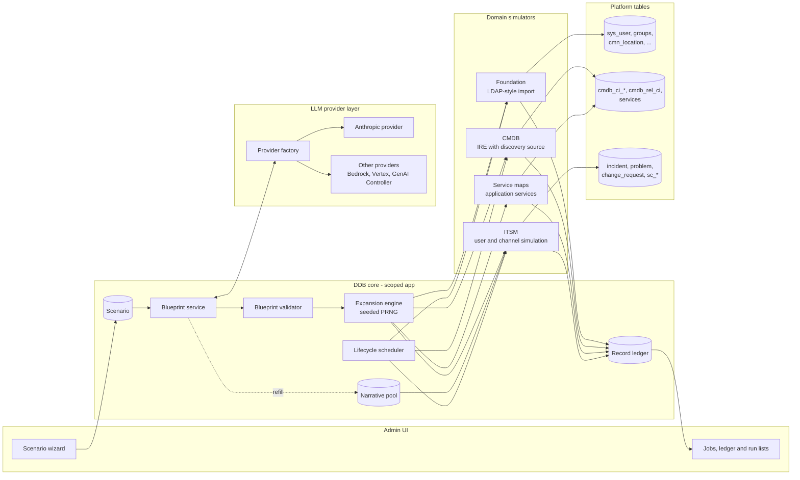
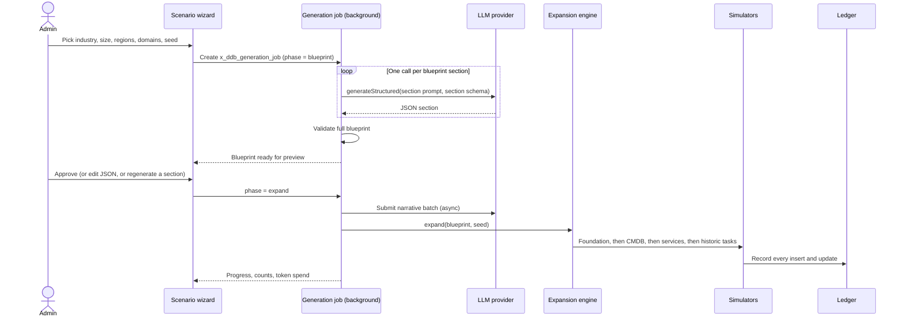
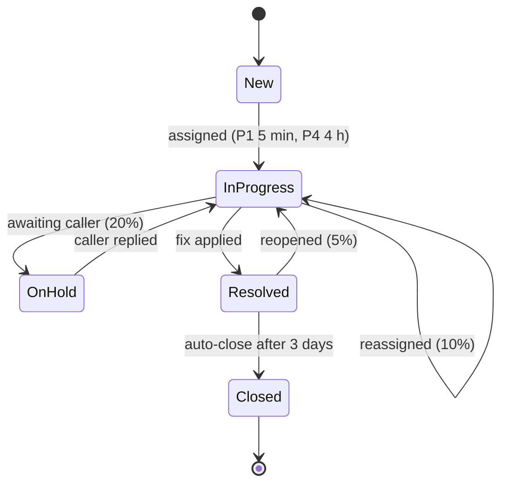

# Demo Data Builder: Design

| | |
|---|---|
| Status | Draft for review |
| Scope | Architecture and design. No application code yet. |
| Target | ServiceNow scoped application for demo instances and PDIs |
| LLM | Pluggable provider. First implementation: Anthropic Claude API |

---

## 1. Problem and goals

A fresh PDI or demo instance has a thin, obviously fake data set. Anything you PoC on top of it
(CMDB health dashboards, AIOps, Now Assist summarisation, SLA reporting, custom apps) looks
unconvincing, and the data never changes, so anything that depends on history or trends has nothing to
work with.

Demo Data Builder (DDB) fixes this in three ways:

1. **Coherent data.** Claude designs one fictional company (org chart, sites, application portfolio,
   infrastructure, service catalog, recurring operational problems). Every generated record follows
   from that one design, so users sit in the right departments, incidents reference CIs that actually
   support the affected service, and changes fix the problems that caused the incidents.
2. **Realistic provenance.** Records arrive the way they do in production. Users and groups come in
   through an LDAP-shaped import set. CIs go through the Identification and Reconciliation Engine (IRE)
   with a discovery source, the same path Discovery and Service Mapping use. Requests are ordered
   through the catalog API so the platform's own flows and approvals run.
3. **Living data.** A scheduler keeps working the data: tickets progress and close, new ones open,
   CIs drift and get rediscovered, people join, move and leave. Over days and weeks the instance builds
   up the history that reporting, ML and process-mining PoCs need.

### Goals

- Installs on a vanilla PDI with no paid plugins. Uses ITOM, Service Mapping or Event Management
  features when they are present and degrades gracefully when they are not.
- Reproducible. Same blueprint and seed give the same instance.
- Reversible. Every record DDB creates or changes is recorded in a ledger and can be removed.
- Cheap to run. Claude supplies structure and language. Volume comes from deterministic expansion
  and a reusable pool of pre-generated text, not one API call per record.
- Provider-neutral. Claude via the Anthropic API first. Bedrock, Vertex AI and ServiceNow's Generative
  AI Controller can be added behind the same interface.

### Non-goals

- Running on production instances. DDB refuses to run there (section 11).
- Simulating real Discovery probes, MID Servers or the ECC queue. DDB writes the *results* that
  Discovery would write. It does not run Discovery.
- Generating HR, CSM, SecOps or SPM data in the first release (see roadmap, section 13).

---

## 2. Architecture overview



The flow for an initial build:



Each phase is a separate background step (section 4.4), so no single transaction runs long and a
failed phase can be retried on its own.

---

## 3. Application scope and packaging

### 3.1 Scope

| Item | Value |
|---|---|
| Name | Demo Data Builder |
| Scope | `x_<vendor>_ddb` (the instance's vendor prefix; shortened to `x_ddb` in this document) |
| Roles | `x_ddb.admin` (configure providers, run generation, reset data), `x_ddb.user` (view jobs, ledger and runs) |
| Menu | Demo Data Builder > Scenarios, Blueprints, Generation Jobs, Lifecycle Profiles, Lifecycle Runs, Record Ledger, Narrative Pool, Prompt Templates, Providers, Properties |

### 3.2 Writing to global tables

The app writes to tables outside its scope (`sys_user`, `sys_user_group`, `sys_user_grmember`,
`cmn_location`, `cmn_department`, `core_company`, `cmn_cost_center`, `cmdb_ci*`, `cmdb_rel_ci`,
`svc_ci_assoc`, `incident`, `problem`, `change_request`, `task_ci`, `sc_cat_item`, `item_option_new`,
`sc_request`, `sc_req_item`, `sc_task`, `sys_journal_field` through the journal APIs, and so on).

- Cross-scope runtime access is captured as `sys_scope_privilege` records and shipped with the app,
  so the admin is not prompted on first run.
- Each target table's **Application Access** settings must allow create, update and delete from other
  scopes. The installer checks this at startup and lists any table that blocks access.

### 3.3 Optional global helper

A few things scoped scripts cannot do:

- Back-date system fields (`sys_created_on`, `sys_created_by`) with `autoSysFields(false)`.
- Run a block of work as another user (`gs.getSession().impersonate()`), so `sys_created_by`, the
  journal author and audit history show the simulated user instead of the integration account.

DDB ships a second, optional update set, **DDB Global Helper**, with one global Script Include
(`DDBGlobalBridge`) that exposes just those two operations. It is marked accessible from the DDB scope
only, and each method checks the caller's scope and the production guard. Without the helper DDB still
works: records show the `ddb.simulator` user as creator, and history starts at install time instead of
being back-filled.

### 3.4 Repository layout

The app is authored as plain files and compiled into an update set by `build/build.js`; see the
README for the full table.

```
/app/                     Source: app.json, script_includes/, tables/, records/, scripts/, prompts/
/build/                   Update set generator (deterministic sys_ids, dependency-ordered updates)
/dist/                    Generated update set, committed: ddb-<version>.xml
/servicenow/              Generated Studio source-control layout (sn_source_control.properties points here)
/test/                    Node tests against in-memory Glide mocks
/docs/                    This design, INSTALL.md, schema, examples
```

The optional global helper (3.3) is not part of Phase 1; it ships as a separate update set when the
ITSM simulator needs it.

Installing on a PDI: use Studio's Import From Source Control on this repository, or import
`dist/ddb-<version>.xml` as a retrieved update set; see [INSTALL.md](INSTALL.md).

### 3.5 Plugins

| Plugin | Needed? | Used for |
|---|---|---|
| CMDB CI Class Models (`com.snc.cmdb.ci_class_models`, active on PDIs) | Required | CI classes for servers, databases, app servers and network devices |
| Service Catalog, Incident, Problem, Change (base ITSM) | Required | Task generation |
| Change Management - Change models | Optional | Model-driven change states. Falls back to legacy state handling |
| CSDM application services (`cmdb_ci_service_auto` family, base platform) | Required | Application services and service maps |
| Service Mapping | Optional | When present, application services are created as `cmdb_ci_service_discovered` |
| Event Management | Optional | Simulated events and alerts that feed incidents |
| Discovery | Optional | Registers `ServiceNow` as a selectable discovery source. DDB uses its own source otherwise |

The installer detects plugins with `GlidePluginManager.isActive()` and stores the results in
`x_ddb.capabilities.*` properties that the simulators read.

---

## 4. LLM provider layer

### 4.1 Interface

Every provider is a Script Include that implements the same contract. The rest of the app never calls
a REST message directly.

```javascript
// x_ddb.LLMProvider (abstract)
generateStructured(request)   // -> { data: Object, usage: Usage, stopReason: String, raw: String }
generateText(request)         // -> { text: String, usage, stopReason, raw }
submitBatch(requests)         // -> { batchId: String } (providers without batch support run them inline)
pollBatch(batchId)            // -> { status: 'in_progress'|'ended', results: [ { customId, data|text|error } ] }
estimateCost(usage)           // -> Number, in the provider config's currency
healthCheck()                 // -> { ok: Boolean, message: String }

// request = {
//   purpose:   'blueprint' | 'narrative' | 'repair',
//   system:    String,   // stable content, cached where the provider supports it
//   messages:  [ { role, content } ],
//   schema:    Object,   // JSON Schema, for generateStructured
//   maxTokens: Number,
//   effort:    'low' | 'medium' | 'high'
// }
```

`x_ddb.ProviderFactory.get(purpose)` reads `x_ddb_provider_config` and returns the provider configured
for that purpose. Blueprint and narrative work can use different providers or models.

### 4.2 Anthropic provider

| Concern | Design |
|---|---|
| Endpoint | `POST https://api.anthropic.com/v1/messages` through an outbound REST Message (`x_ddb_anthropic_messages`) |
| Headers | `x-api-key`, `anthropic-version: 2023-06-01`, `content-type: application/json` |
| Credential | API Key credential (`api_key_credentials`) bound to a Connection & Credential alias (`x_ddb.anthropic`). Read at runtime with `sn_cc.StandardCredentialsProvider`. The key is never stored in a script or property |
| Model | Configured per purpose in `x_ddb_provider_config`. Default `claude-opus-5-5` for both blueprint and narrative. Admins can pick a cheaper model for narrative refills if output quality holds |
| Structured output | `output_config.format` with `{"type": "json_schema", "schema": ...}`. The response's text block is guaranteed to parse and match the schema. (Forced `tool_choice` is not used: current models reject it with a 400.) |
| Effort | `output_config.effort`. `medium` for blueprint sections, `low` for narrative batches. The model's thinking can't be switched off; effort is the cost and latency control |
| Refusals | Request sets `fallbacks: "default"` with header `anthropic-beta: server-side-fallback-2026-07-01`, so a request declined by a safety classifier is retried on a fallback model inside the same call. The provider still checks `stop_reason` before reading content: `refusal` and `max_tokens` are logged and the section is retried once with a smaller scope |
| Prompt caching | The system prompt (instructions plus the approved blueprint summary) is identical for every narrative request in a scenario and carries `cache_control: {"type": "ephemeral"}`. Volatile content goes after it. `usage.cache_read_input_tokens` is logged to confirm hits |
| Bulk text | Narrative refills go through the Message Batches API (`POST /v1/messages/batches`), which runs asynchronously at half price. A scheduled poll collects results. This also avoids outbound HTTP timeouts entirely |
| Errors | 429 and 529 (overloaded): retry after the `retry-after` header or exponential backoff (2, 4, 8, 16 s; four attempts). 5xx and connection errors: same. 400, 401, 403, 404: fail fast, record the response body on the job |
| Logging | Every call writes an `x_ddb_llm_call` row: purpose, model, prompt template version, SHA-256 of the prompt, input, output, cache-read and cache-write tokens, latency, stop reason, estimated cost |

Example blueprint section request body:

```json
{
  "model": "claude-opus-5-5",
  "max_tokens": 16000,
  "fallbacks": "default",
  "output_config": {
    "effort": "medium",
    "format": { "type": "json_schema", "schema": { "...": "section schema" } }
  },
  "system": [
    {
      "type": "text",
      "text": "You design fictional but realistic companies for ServiceNow demo instances...",
      "cache_control": { "type": "ephemeral" }
    }
  ],
  "messages": [
    {
      "role": "user",
      "content": "Scenario: industry=Transportation and logistics; size=mid (800 staff); regions=UK, NL; ...\nProduce the company, locations, departments and people sections."
    }
  ]
}
```

### 4.3 Other providers

| Provider | Notes |
|---|---|
| `BedrockProvider` | Claude on Amazon Bedrock. Same request body; model IDs take an `anthropic.` prefix. Requests are SigV4 signed (AWS auth profile, or a small signer Script Include where the release has none) |
| `VertexProvider` | Claude on Google Vertex AI. OAuth 2.0 JWT bearer flow with a service-account credential; model IDs are the bare Claude IDs |
| `GenAIControllerProvider` | For instances with Now Assist. Calls a custom skill through the Generative AI Controller so the customer's governance and logging apply. Structured output is enforced by validating and repairing (section 6.3) because the controller may not pass `output_config` through |

Only `AnthropicProvider` is in scope for the first release. The others are interface stubs that throw
`NotImplemented`, so the configuration UI and factory are designed for them from the start.

### 4.4 Running long calls

Outbound REST calls from ServiceNow are synchronous and bounded by the outbound timeout
(`glide.http.outbound.max_timeout`). A full blueprint can take longer than that to generate, so:

- Generation runs in background workers (a scheduled-job dispatcher and event-driven Script Actions),
  never in a UI transaction.
- The blueprint is generated **in sections** (company/locations/departments/people, then
  groups/applications, then infrastructure/catalog/themes). Each section call is small, and later
  sections get earlier ones as context so keys line up.
- Narrative text uses the Batches API (submit, then poll), so no request waits on generation.
- The setup check reports the effective timeout and recommends a value if it is too low for the
  configured model and effort.

---

## 5. Data model

All tables are in the app scope. `sys_id` references are shown as `->`.

| Table | Key fields | Purpose |
|---|---|---|
| `x_ddb_provider_config` | name, provider (choice), purpose (blueprint, narrative, any), model, effort, credential alias, max tokens, daily token budget, active | Which provider and model to use for what |
| `x_ddb_scenario` | name, industry, company size tier, headcount, regions, seed, domains (foundation, cmdb, services, itsm), history days, volumes JSON, state | What the admin asked for |
| `x_ddb_blueprint` | -> scenario, version, JSON (large string), state (draft, validated, approved, superseded), validation errors, generated by (provider/model) | Claude's design for the company |
| `x_ddb_generation_job` | -> scenario, -> blueprint, phase, state, progress %, counts JSON, log (journal), tokens, estimated cost, started, finished | One build or reset |
| `x_ddb_record_ledger` | -> job or lifecycle run, table, document sys_id, domain, action (insert, update, delete), blueprint key, created | Everything DDB touched. Basis for reset and reporting |
| `x_ddb_lifecycle_profile` | -> scenario, active, cadence, business hours schedule, timezone, rates JSON (per domain), max records per run, daily token budget, last run | How the data should evolve |
| `x_ddb_lifecycle_run` | -> profile, simulated window start and end, counts JSON, errors, duration | One scheduler tick |
| `x_ddb_narrative_pool` | -> scenario, category, theme key, CI role, state or transition, text, placeholders, used count, last used | Reusable Claude-written text |
| `x_ddb_prompt_template` | name, purpose, version, system text, user text, schema reference, active | Editable prompts, versioned so outputs can be traced |
| `x_ddb_llm_call` | -> job or run, provider, model, template version, prompt hash, tokens (in, out, cache read, cache write), latency, stop reason, cost, error | Audit and cost tracking |
| `x_ddb_dir_user`, `x_ddb_dir_group` | Active Directory attributes (section 7.1) | The simulated directory that the foundation sync reads |

Ledger rows are written by one Script Include (`x_ddb.Ledger`), called by every simulator, rather than
by business rules on global tables, so the app does not add load or behaviour to tables other apps use.

---

## 6. Blueprint and expansion

### 6.1 What Claude decides vs. what scripts decide

| Claude (blueprint and narrative) | Expansion engine (deterministic) |
|---|---|
| Company identity, industry, naming conventions | Exact counts, derived from headcount and weights |
| Location hierarchy and which sites are datacenters | Every individual user, generated from name locales and patterns |
| Departments, job titles, cost centers | Manager chains, group membership |
| Named personas (CIO, service desk lead, app owners) | Hostnames, IP addresses, serial numbers, MAC addresses |
| Group taxonomy and responsibilities | Which CI hosts which, cluster membership |
| Application portfolio: tiers, technologies, dependencies, entry points | Ticket volumes and arrival times |
| Catalog items and their variables | Which user raised which ticket against which CI |
| Operational themes: symptoms, root causes, fixes | State transitions and timings |
| Ticket descriptions, work notes, resolution notes, change plans | Filling narrative placeholders with concrete records |

The blueprint format is defined in [`schemas/blueprint.schema.json`](schemas/blueprint.schema.json),
with a worked example in [`examples/blueprint.example.json`](examples/blueprint.example.json). Objects
use stable `key` values; every cross-reference (`department_key`, `support_group_key`,
`depends_on_keys`, ...) uses those keys.

The schema stays within what Claude structured outputs support: every object has
`additionalProperties: false` and lists all its properties as required, nullable fields use
`anyOf` with `null`, and there are no numeric or string-length constraints. Rules that the schema
cannot express are checked by the validator.

### 6.2 Seeded expansion

The expansion engine uses a seeded PRNG (for example mulberry32 or sfc32 in a Script Include). The
seed comes from the scenario. Each sub-generator derives its own stream from `seed + domain + key`,
so adding an application doesn't reshuffle every user.

Records DDB creates directly (not through IRE) get a deterministic `sys_id` from
`setNewGuidValue(hash(scenario seed, table, blueprint key, ordinal))`. Re-running expansion therefore
updates the same records instead of duplicating them, and the ledger can be rebuilt from the
blueprint if it is ever lost. CIs get idempotency from IRE identification rules instead (section 7.2).

### 6.3 Validation and repair

Before anything is written, `x_ddb.BlueprintValidator` checks:

1. JSON Schema conformance (redundant for Anthropic structured output, needed for other providers).
2. Referential integrity: every `*_key` points at an object that exists, and there are no cycles in
   `parent_key`, `manager_key` or `depends_on_keys`.
3. Platform fit: each `ci_class` exists in `sys_db_object` and extends `cmdb_ci`; each `role` exists;
   each timezone is valid.
4. Sanity limits: weights sum close to 1, instance counts and host counts within the scenario's size tier.

Failures are listed on the blueprint record. The admin can fix the JSON by hand, or press
**Repair**, which sends the blueprint and the error list back to Claude (purpose `repair`) and asks for
a corrected section.

### 6.4 Scenario size tiers

| Tier | Users | Groups | CIs (approx.) | Applications | Historic incidents (90 days) |
|---|---|---|---|---|---|
| Small | 200 | 15 | 400 | 5 | 600 |
| Medium | 1,000 | 40 | 2,500 | 15 | 3,000 |
| Large | 5,000 | 120 | 12,000 | 40 | 15,000 |

PDIs have limited capacity, so Medium is the default and Large shows a warning.

---

## 7. Domain simulators

Simulators are Script Includes with a common shape:
`build(blueprint, ctx)` for the initial load, `tick(profile, window, ctx)` for lifecycle runs, and
`reset(ledgerRows)` for cleanup. `ctx` carries the PRNG, ledger, narrative pool and capability flags.

### 7.1 Foundation: simulated directory sync

Goal: users, groups and locations should look like they came from an Active Directory / LDAP import.

1. The engine builds LDAP-shaped rows:

   | Column | Example |
   |---|---|
   | `dn` | `CN=Femke de Vries,OU=Depot Operations,OU=Users,OU=Rotterdam,DC=corp,DC=haldenfreight,DC=example` |
   | `samaccountname` | `femke.devries` |
   | `userprincipalname` | `femke.devries@haldenfreight.example` |
   | `givenname`, `sn`, `title`, `department`, `physicaldeliveryofficename` | |
   | `manager` | DN of the manager |
   | `memberof` | Group DNs |
   | `objectguid` | Deterministic GUID |
   | `useraccountcontrol` | `512` (enabled) or `514` (disabled) |

2. Rows are written to the simulated directory, `x_ddb_dir_user` and `x_ddb_dir_group`. The
   directory is the source of truth for people, as Active Directory is in production; later
   lifecycle runs change the directory and re-sync.
3. A scripted sync (`FoundationSimulator.syncUser`), modelled on the platform's LDAP transform,
   coalesces on `objectguid` and sets `sys_user.source` to `ldap:<dn>`, plus `user_name`, `email`,
   `manager`, `department`, `location`, `company`, `cost_center`, `title`, `active`. Group membership
   becomes `sys_user_grmember`.
4. Locations, companies, departments and cost centers are written first, so users can reference them.

   *Phase 1 decision:* the original design loaded rows through import sets and transform maps. A
   scripted sync was chosen instead because it needs no transform-map metadata, runs in bounded
   background steps, and can be unit-tested. The resulting records look the same.
5. Named personas from the blueprint get matching `sys_user_has_role` entries for their roles, and
   optionally a known demo password so presenters can log in as them.

Lifecycle behaviour (each tick, at the profile's rates):

- **Joiners:** new rows in the next "sync" with new GUIDs, often followed by a catalog request for a
  laptop and access (section 7.4).
- **Movers:** department, title, manager or location changes; group membership follows the department.
- **Leavers:** `useraccountcontrol = 514`, which transforms to `active = false`, removal from groups and
  an offboarding request. Open tasks assigned to them get reassigned.

### 7.2 CMDB: simulated Discovery

Goal: CIs should look discovered: correct classes, identifiers, discovery source, first and last
discovered dates, and relationships.

- All CI writes go through the scoped IRE API,
  `sn_cmdb.IdentificationEngine.createOrUpdateCI(source, payload)`, never direct GlideRecord inserts.
  IRE applies the instance's identification rules, reconciliation rules and data-source precedence,
  just as it does for Discovery and Service Graph Connectors.
- **Discovery source:** the app adds `DemoDataBuilder` to the `discovery_source` choice list. A
  property (`x_ddb.cmdb.masquerade_source`) can switch to `ServiceNow` so that dashboards and CMDB
  Health rules that filter on Discovery treat DDB CIs as discovered. Default is off, so DDB data stays
  easy to identify.
- **Payload:** one IRE call per host "scan", containing the host and everything discovered on it,
  like a Discovery pattern would send:

  ```json
  {
    "items": [
      { "className": "cmdb_ci_linux_server",
        "values": { "name": "aws-euw2prdapp01", "serial_number": "ec2-0f3a...", "ip_address": "10.40.12.21",
                    "os": "Linux Ubuntu", "os_version": "24.04", "cpu_count": 4, "ram": 16384,
                    "location": "<sys_id>", "support_group": "<sys_id>", "environment": "Production",
                    "first_discovered": "...", "last_discovered": "..." } },
      { "className": "cmdb_ci_network_adapter",
        "values": { "name": "eth0", "mac_address": "02:4a:...", "ip_address": "10.40.12.21" } },
      { "className": "cmdb_ci_app_server_tomcat",
        "values": { "name": "tomcat@aws-euw2prdapp01", "version": "10.1.28", "tcp_port": "8080" } }
    ],
    "relations": [
      { "parent": 1, "child": 0, "type": "Owns::Owned by" },
      { "parent": 2, "child": 0, "type": "Runs on::Runs" }
    ]
  }
  ```

- **Topology built per application tier:** load balancers -> web -> app -> database
  (`Depends on::Used by`), app servers `Runs on` hosts, VMs `Virtualized by::Virtualizes` ESX hosts or
  are linked to cloud resources, hosts `Connects to` switches in their location, IP addresses from the
  blueprint ranges.
- **Shared services** (AD, backup, monitoring) get their own servers, and every application consumes
  them.
- Optional realism: `discovery_status` records ("Discovery schedule: Leeds DC1 nightly") summarising
  each simulated scan, so the Discovery dashboard has something to show when the Discovery plugin is
  active. DDB never writes to the ECC queue.

Lifecycle behaviour:

- **Rediscovery:** each tick "rescans" a slice of hosts by location and updates `last_discovered`.
  A configurable share of hosts is skipped on purpose so CMDB Health staleness rules have findings.
- **Drift:** OS patch versions, RAM, CPU, installed software versions change at low rates. Drift is
  tied to change requests where possible (an implemented patching change bumps the OS versions on its
  affected CIs).
- **Growth and retirement:** new VMs appear (scale-out, new projects); old ones get
  `install_status = Retired` after a decommission change.
- **Data quality noise** (optional): a small rate of duplicate CIs from a second, lower-precedence
  source, missing serial numbers, orphaned relationships. This gives CMDB Health and de-duplication
  PoCs something to find.

### 7.3 Service maps: simulated Service Mapping

Goal: each blueprint application appears as a CSDM-aligned set of services with a populated map.

| Blueprint item | Records |
|---|---|
| Application | `cmdb_ci_business_app` |
| Application, as the business sees it | `cmdb_ci_service` (business service) with service offerings (`service_offering`) per environment |
| Each environment of the application | Application service. `cmdb_ci_service_discovered` when Service Mapping is active, otherwise `cmdb_ci_service_calculated` |
| Entry points | `cmdb_ci_endpoint_http` (or tcp, mq, db) linked to the application service |
| Shared services | Technical services (`cmdb_ci_service_technical`) |

Relationships follow CSDM: application service `Consumes::Consumed by` business app, business service
offering `Depends on::Used by` application service, application service `Depends on::Used by` the top-tier CIs
(through its entry point), and application services that depend on each other per `depends_on_keys`.

Map contents (`svc_ci_assoc`):

- For calculated services, DDB sets the entry point and level count and lets the platform's service
  population run over the relationship tree built in 7.2. Because DDB built that tree, the result is
  exactly the application's tiers.
- For discovered services (Service Mapping active), DDB writes `svc_ci_assoc` rows directly from the
  tier model, because the real Service Mapping pattern engine won't run against simulated hosts.
- A verification step compares each map with the tier model and reports mismatches.

Lifecycle behaviour: scale-out adds members to the map; retired CIs drop out; occasionally a new
dependency between two applications appears, preceded by a change request.

### 7.4 ITSM: simulated user activity

Goal: tasks should look raised by real people through real channels, at realistic times, against the
right CIs.

**Arrival model.** Volumes come from the scenario's size tier. Arrivals follow a non-homogeneous
Poisson process weighted by business hours in each user's timezone, with a Monday peak and a weekend
trough. Themes from the blueprint add bursts (a `degradation` theme yields a cluster of related
incidents within an hour).

**Incidents**

| Channel (`contact_type`) | Share | Simulation |
|---|---|---|
| Self-service | 40% | Caller is a generated user; short, informal description |
| Email | 25% | Created through an `sys_email`-shaped record and the inbound action path where feasible; otherwise direct insert with email-styled description |
| Phone | 20% | `opened_by` is a service desk agent; `caller_id` is the user |
| Event / monitoring | 15% | When Event Management is active, an `em_event` that creates an alert and incident through the platform's alert rules. Otherwise, an incident opened by the monitoring integration user, with the CI set |

Each incident picks a theme (weighted) or a generic category, a CI from that theme's application and
CI roles, a caller from the location and department that would plausibly notice, and text from the
narrative pool with placeholders filled. Assignment follows the CI's `support_group`.

**Problems** are created when a theme recurs past a threshold. Related incidents are linked; the
problem goes to root cause analysis with the theme's `root_cause`, then a known error with a workaround.

**Changes**

- Standard changes from templates the blueprint implies (patching, password policy, certificate renewal).
- Normal changes raised to fix problems (from the theme's `fix`), with CAB approval through the
  blueprint's approval group.
- Emergency changes after `outage` themes.
- Affected CIs (`task_ci`) and impacted services are populated, and planned start and end fall in
  maintenance windows.

**Requests** use the catalog API (`sn_sc.CartJS`, `orderNow` with `sysparm_requested_for` and variable
values) against catalog items DDB creates from the blueprint (`sc_cat_item`, `item_option_new`). The
platform's own flows, approvals and fulfilment tasks run, which is the point: PoCs that build on
request fulfilment see real `sc_req_item` and `sc_task` records and approvals.

**Who did it.** With the global helper, each action runs impersonated as the simulated user, so
`sys_created_by`, journal authors and audit history are right. Without it, actions run as
`ddb.simulator` and DDB sets `caller_id`, `opened_by`, `assigned_to` and `requested_for` explicitly;
journal entries are attributed to `ddb.simulator`.

**History back-fill.** The initial build can generate the last *N* days (default 90). With the global
helper, `sys_created_on` and `opened_at` are back-dated and state changes replayed in time order.
Without it, only `opened_at`, `resolved_at` and `closed_at` are back-dated. SLAs and metrics don't
back-fill either way. This is documented as a known limitation, and lifecycle runs produce genuine
SLA and metric data from install time onwards.

---

## 8. Lifecycle simulation

### 8.1 Scheduling

One scheduled job, **DDB Lifecycle Dispatcher** (`sysauto_script`, every 15 minutes, run as
`ddb.simulator`), reads active `x_ddb_lifecycle_profile` records and decides whether each is due. This
avoids creating or editing scheduled jobs at runtime.

Each tick:

1. Works out the simulated window: from the profile's last run to now, capped at `max_catch_up`
   (default 24 hours). PDIs hibernate when idle and jobs don't run while asleep; the cap stops the
   first tick after waking from generating a week of tickets at once.
2. Checks the kill switch (`x_ddb.lifecycle.enabled`), the production guard and the daily token budget.
3. Runs each simulator's `tick()` in order: foundation, CMDB, services, ITSM.
4. Writes an `x_ddb_lifecycle_run` row and ledger rows.
5. If the narrative pool for any category is below its low-water mark, submits a refill batch.

Lifecycle runs make **no synchronous LLM calls**. They only read the narrative pool, so a tick is fast
and predictable, and provider outages don't stop the simulation.

### 8.2 Task state machines

Each task table has a state machine defined as data (a JSON property per table, editable by the
admin), with weighted transitions and dwell-time distributions per priority.



On each transition the simulator adds the right journal entries from the narrative pool (agent work
notes, caller comments, resolution notes) and sets the fields the platform expects (`close_code`,
`close_notes`, `resolved_by`, `hold_reason`). Changes follow their model (New, Assess, Authorize,
Scheduled, Implement, Review, Closed) with approvals generated and approved or rejected by members of
the approval group. Requests are advanced by completing the `sc_task` records the platform's flows
created, not by setting the request state directly.

Timings honour the profile's business-hours schedule, so SLA breaches happen at realistic rates (a
configurable fraction of tickets is deliberately left idle long enough to breach).

### 8.3 Storylines

A storyline ties domains together and makes demos memorable. Admins can trigger one on demand or let
the scheduler pick one at a low rate:

- **Incident storm:** a CI degrades, event-sourced and user-reported incidents arrive within minutes,
  a major incident is declared, a problem is opened, an emergency change applies the fix, and CI
  attributes change when the change is implemented.
- **New starter wave:** a batch of joiners, each with laptop and access requests, approvals and
  fulfilment tasks.
- **Data center migration:** CIs move location over several weeks through a series of normal changes,
  and service maps update as they go.

### 8.4 Guardrails

| Control | Default |
|---|---|
| `x_ddb.lifecycle.enabled` (kill switch) | true |
| Max records created or updated per tick | 500 |
| Max catch-up window | 24 h |
| Daily LLM token budget per provider config | 2,000,000 tokens |
| Narrative pool low-water mark per category | 50 entries |
| Max open tasks per assignment group | 150 (stops a backlog growing without bound) |

---

## 9. Admin experience

Built with classic forms, lists and a UI Page wizard, so it works on every release and installs
cleanly as an update set. A Configurable Workspace can come later.

1. **Setup check** (UI Page): production guard, plugin capabilities, Application Access on target
   tables, credential alias present, provider `healthCheck()`, outbound timeout, global helper present.
2. **Scenario wizard:** industry (free text with suggestions), company name (optional; Claude
   proposes one), size tier, regions, domains, history days, seed (random by default).
3. **Blueprint preview:** a readable summary (org chart, application list with tiers, catalog,
   themes) and the raw JSON, with **Regenerate section**, **Repair**, **Edit JSON** and **Approve**.
4. **Generation progress:** phase, progress bar, live counts, token spend, log.
5. **Lifecycle profile form:** cadence, rates per domain (sliders for incidents per day, joiner and
   leaver rates, drift rates), business hours, storylines on or off.
6. **Reset:** remove everything from a job, a scenario, or all DDB data (section 10).

Reports and a dashboard show records by domain, tasks opened and closed per day, CI freshness, LLM
spend over time, and lifecycle run health.

---

## 10. Cleanup and idempotency

- **Reset** reads the ledger and deletes in reverse dependency order: tasks (and their journal, SLA,
  approval and `task_ci` rows), catalog requests, service associations, relationships, CIs (through
  IRE-aware deletion so reconciliation data is cleaned), group memberships, users, groups,
  departments, locations, companies. Deletes run in chunks through a background job.
- Records DDB only **updated** (for example an OOB user it added to a group) are restored from the
  ledger's before-image instead of deleted.
- **Re-running** the same blueprint and seed updates existing records: deterministic `sys_id`s for
  directly created records, coalescing transforms for foundation data, IRE identification for CIs.
- A **dry run** mode expands the blueprint and reports counts per table without writing anything.

---

## 11. Security and safety

- **Production guard:** every entry point (UI actions, the dispatcher, the global helper) calls
  `x_ddb.Guard.assertNonProduction()`, which fails if `glide.installation.production` is true or the
  instance name is not in `x_ddb.allowed_instances` (when that property is set).
- **Credentials:** API keys live only in credential records bound to an alias; they are never logged.
  `x_ddb_llm_call` stores a hash of the prompt, not the key or headers.
- **Data sent to Claude:** the scenario parameters, the blueprint (synthetic) and prompt templates.
  DDB never sends existing instance data, so no real personal data leaves the instance. A test
  enforces that prompt builders only read DDB tables.
- **Roles:** only `x_ddb.admin` can configure providers, approve blueprints, start jobs or reset.
- **Global helper:** callable only from the DDB scope, guarded, and limited to impersonating users
  that the ledger shows DDB created. It cannot impersonate admins or OOB users.
- **Cost control:** daily token budget per provider config, estimated cost shown before a job starts,
  and every call logged.

---

## 12. Prompts

Prompt templates are records (`x_ddb_prompt_template`), versioned, so they can be tuned without
code changes and every output can be traced to the template that produced it.

| Template | Purpose | Output |
|---|---|---|
| `blueprint.org` | Company, locations, departments, people | Section of the blueprint schema |
| `blueprint.apps` | Groups and application portfolio, given the org | Section |
| `blueprint.infra` | Infrastructure, catalog, themes, given org and apps | Section |
| `blueprint.repair` | Fix listed validation errors in one section | Section |
| `narrative.incident` | For a theme or category: short descriptions, descriptions, work notes per transition, resolution notes, all with placeholders (`{caller_first}`, `{ci}`, `{app}`, `{agent_first}`) | JSON array of variants |
| `narrative.change` | Justification, implementation, backout and test plans, review notes | JSON array |
| `narrative.request` | Request comments and fulfilment notes per catalog item | JSON array |
| `narrative.problem` | RCA notes and workarounds per theme | JSON array |

Prompt guidance baked into the templates: fictional company only, no real people or brands, UK or US
English to match the company's headquarters, the tone and terseness of real tickets (callers are
brief, agents use shorthand), and variety across variants.

---

## 13. Roadmap

| Phase | Scope | Exit criteria |
|---|---|---|
| P1: Foundation | Provider layer (Anthropic), scenarios, blueprint generation and validation, ledger, foundation simulator, setup check, reset | A Medium scenario creates about 1,000 LDAP-sourced users in under 15 minutes and resets cleanly |
| P2: CMDB and services | IRE-based CMDB simulator, service maps, CMDB lifecycle (rediscovery, drift, retirement) | Every blueprint application has a populated map; CMDB Health shows realistic scores |
| P3: ITSM | Catalog items, incidents, problems, changes, requests, narrative pool and batches, history back-fill | 90 days of history with a realistic opened-per-day curve |
| P4: Lifecycle | Dispatcher, state machines, joiner/mover/leaver, storylines, guardrails, dashboard | Runs unattended for 14 days on a PDI within budget |
| P5: Extensions | Bedrock, Vertex and GenAI Controller providers; HRSD, CSM and SecOps domains; Configurable Workspace UI; scenario sharing (export and import blueprints) | |

---

## 14. Risks and open questions

| Risk or question | Mitigation or proposal |
|---|---|
| PDIs hibernate and get reclaimed, so lifecycle stops | Catch-up cap on wake; blueprints exportable so a scenario can be rebuilt on a new PDI |
| Outbound timeout shorter than a blueprint call | Sectioned generation, Batches API for bulk text, setup check recommends a timeout |
| CI class and table differences between releases | Validator checks classes against `sys_db_object`; capability flags per release |
| Scoped apps can't back-date or impersonate | Optional global helper with tight guard rails; documented behaviour without it |
| Platform flows on generated requests or changes send notifications | Simulated users get `notification = disabled` and fictional `.example` addresses; email sending is unaffected on PDIs by default but the setup check warns if outbound mail is on |
| Load on small PDIs | Size tiers, per-tick record cap, chunked background work |
| Cost per scenario | Estimate before running; expected order of magnitude is a few hundred thousand tokens for a Medium blueprint plus initial narrative pool, mostly batched |
| Should DDB data masquerade as `ServiceNow` discovery by default? | Proposal: no; keep it a property |
| Do we need a non-LLM fallback (static blueprint library) for instances without outbound internet? | Proposal: ship the example blueprints so the expansion engine works offline; only narrative variety suffers |
